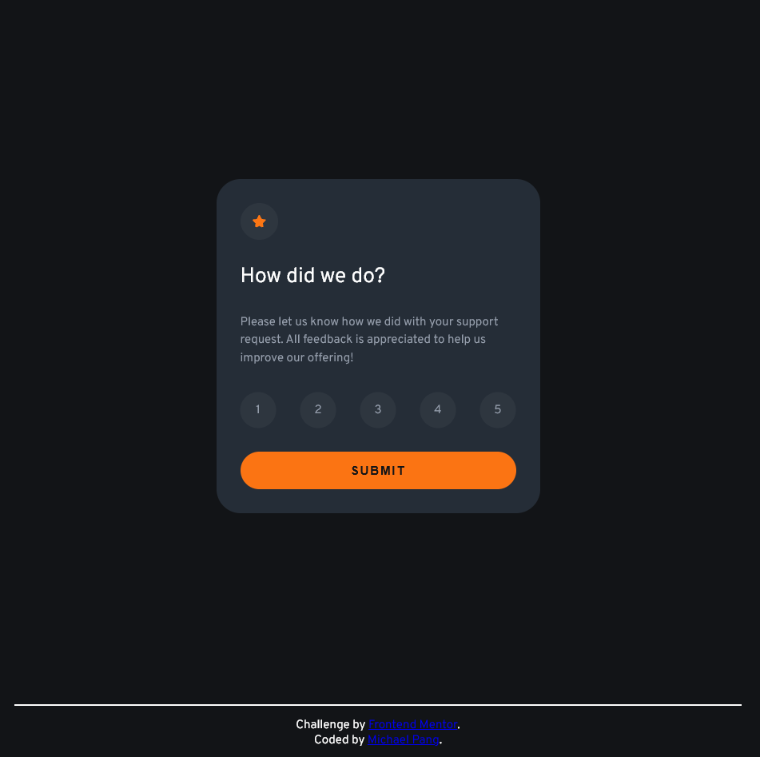

# Frontend Mentor - Interactive rating component solution

This is a solution to the [Interactive rating component challenge on Frontend Mentor](https://www.frontendmentor.io/challenges/interactive-rating-component-koxpeBUmI). Frontend Mentor challenges help you improve your coding skills by building realistic projects. 

## Table of contents

- [Frontend Mentor - Interactive rating component solution](#frontend-mentor---interactive-rating-component-solution)
  - [Table of contents](#table-of-contents)
  - [Overview](#overview)
    - [The challenge](#the-challenge)
    - [Screenshot](#screenshot)
    - [Links](#links)
  - [My process](#my-process)
    - [Built with](#built-with)
    - [What I learned](#what-i-learned)
    - [Continued development](#continued-development)
  - [Author](#author)

## Overview

### The challenge

Users should be able to:

- View the optimal layout for the app depending on their device's screen size
- See hover states for all interactive elements on the page
- Select and submit a number rating
- See the "Thank you" card state after submitting a rating

### Screenshot

### Links

- Solution URL: [https://github.com/pangm1/FrontEndMentor-Interactive-Rating-Component_pangm1](https://github.com/pangm1/FrontEndMentor-Interactive-Rating-Component_pangm1)

- Live Site URL: [https://front-end-mentor-interactive-rating-ruby.vercel.app](https://front-end-mentor-interactive-rating-ruby.vercel.app)

## My process

### Built with

- Semantic HTML5 markup
- CSS custom properties
- Flexbox
- Mobile-first workflow
- Vanilla Javascript

### What I learned

I've gotten more familiar with styling forms and changing the default styles for controls, as well as fitting and laying out multiple HTML elements in a single space. I've used some techniques from other solutions and advice, such as organizing my CSS styles for a state class, allowing easier transition switching between multiple states.

### Continued development

I wonder if I can translate this state relationship to React and other frameworks once I'll start learning them. I'll also need to learn how to use accessibility APIs and tools.

## Author

- Frontend Mentor - [@pangm1](https://www.frontendmentor.io/profile/pangm1)
